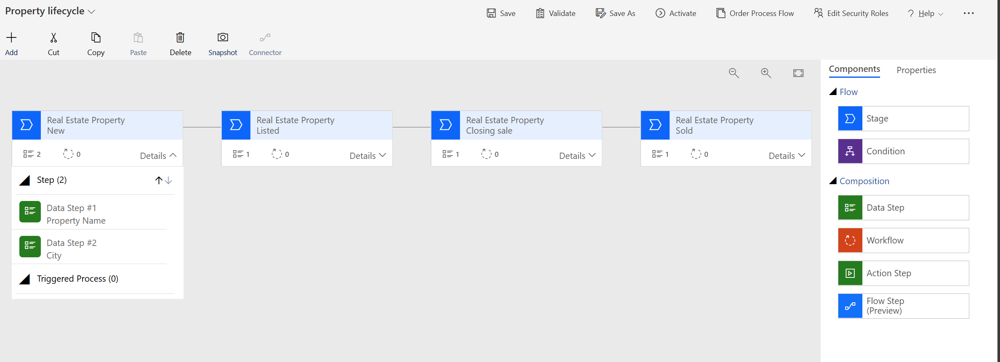

---
lab:
    title: 'Lab 6: Configure a process flow'
    module: 'Module 3: Configure forms, charts, and dashboards in model-driven apps'
---

# Practice Lab 5 - Configure a process flow

## Scenario

In this lab, you will configure a business process flow reflecting the lifecycle of a real estate property

## What you will learn

- How to create new business process flows
- How to apply business process flows to entities and restrict them by security role

## High-level lab steps

- Create the property lifecycle business process flow
- Apply the BPF to the **real estate property** entity
- Restrict the BPF by security role
  
## Prerequisites

- Must have completed **Lab 2: Data model**, **Lab 3: Create model-driven app**, and **Lab 4: Configure forms and views**

## Detailed steps

## Exercise 1 - Create the property lifecycle business process flow

In this exercise, you will configure the process steps

### Task 1.1 – Configure groups

1. Navigate to the Power Apps Maker portal <https://make.powerapps.com>.

1. Make sure you are in the correct environment.

1. Select **Solutions**.

1. Open the **Property listings** solution.

1. Select **+New** on the top menu and, select **Automation > Process > Business Process Flow**.

    

1. In the dialog pane, select **Create**

1. In the business process flow designer add the following stages to capture the lifecycle of a property by dragging 3 **Stage** objects from the right property pane under **Components** 

- New
- Listed
- Closing sale
- Sold

    

1. For each stage add the following data steps, to provide a checklist what is to be filled out at each stage. THe name of the data step indicates the field from the table. **Make sure to click ***Apply*** after each edit to save the data step configuration!**

| Stage      | Data step(s)      |
| ------------- | ------------- |
| New | Property name, City |
| Listed | Asking price,street |
| Closing sale | Asking price, client |
| Sold | Client |

1. In the **Menu bar**, select **Save**, then select **Validate** to check for errors.

1. In the **Menu bar**, select **Activate**

    

### Task 1.2 - Add the process flow to your app

1. Navigate back to the **Property listings** solution which should be still open in the browser tab.

1. In the **Object** pane select **App** and open your model driven app

1. In the **Left hand navigation bar** under **Automation** make sure your new process flow is listed under **In this app**

1. Select **Play** to run the app

1. Select **Real estate properties** in your app and select **+ New** to create a new property. Make sure you can see the new process flow on top of your form.

    

### Task 1.3 – Restrict process flows by security role

1. Navigate back to the process designer.

1. In the **Top menu** select the **Edit security roles**.

1. No security role should be checked. This means that every user with access to the **Real estate property** table can see the process flow.

1. If you select a security role in this dialog and Update the process, only users in the selected role can see the process. This way it is possible to create different processes on the same data tables for different users.

